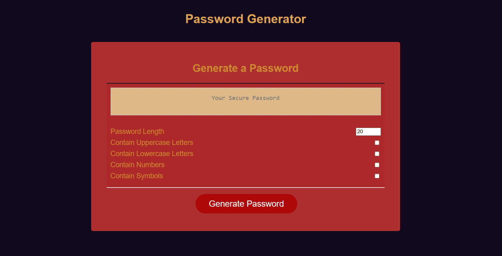

# effective-pasword-barnacle-gen

## An application  that  can used to generate a random password 
The purpose of this web app is to display my proficiency using Intermediate javascript by building a feature dynamically updated HTML and CSS powered by JavaScript website.

## Mock up

## User instructions
This app will run in the browser and  generate a random password based on criteria that have been selected.

* Generate a password when the button is clicked
  * A series of prompts for password criteria can be found
    * You can choose the Length of the password
      * Least amount of characters (10), default value of characters(20) but no more than (64) characters.
    * Choose your Character types at least one character type should be selected code can validate all  inputs
      * Lowercase
      * Uppercase
      * Numeric
      * Special characters ($@%&*, etc)
  * Once prompts are answered  the password is  generated and displayed in the text area

## Known Issues
The portfolio development is still ongoing. More updates coming soon!!.Current known issues to be fixed:
* The copy to clipboard button needs debugging possibly to be rewritten
* Ensure page is responsive and adapts to the viewport